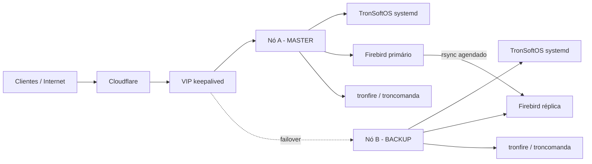

# Arquitetura Host-Based Com HA

## Objetivo

O TronSoftOS deixa de ser executado como container principal e passa a ser hospedado diretamente no host. A camada de containeres permanece apenas para serviços satélites, como `tronfire` e `troncomanda`, quando isso facilitar isolamento, atualização e operação.

## Componentes

| Componente | Execução | Responsabilidade |
| --- | --- | --- |
| TronSoftOS | Host / `systemd` | Aplicação principal e APIs |
| Firebird | Host ou serviço local dedicado | Banco operacional |
| `tronfire` | Container gerenciado | Serviço auxiliar Firebird/integrações |
| `troncomanda` | Container gerenciado | Serviço auxiliar de comandas |
| `keepalived` | Host | VIP, HA e failover |
| `rsync` | Host | Sincronização dos arquivos Firebird |
| Cloudflare | API externa | DNS/proxy/tunnel para o endpoint ativo |

## Topologia Sugerida

## Alta Disponibilidade

Use `keepalived` com VRRP para manter um IP virtual entre dois nós. O nó MASTER anuncia o VIP enquanto o health check do TronSoftOS estiver saudável. Se o health check falhar, o `keepalived` reduz a prioridade ou para de anunciar o VIP, permitindo que o nó BACKUP assuma.

Recomendação inicial:

- Nó A: `MASTER`, prioridade `150`.
- Nó B: `BACKUP`, prioridade `100`.
- Health check: `GET /health` local do TronSoftOS.
- VIP: IP fixo livre na mesma rede dos hosts.

## Failover

O failover deve tratar duas camadas:

1. Aplicação: VIP muda para o nó saudável.
2. Banco: nó secundário precisa ter cópia consistente do Firebird.

Para Firebird com arquivo `.fdb`, a sincronização segura exige cuidado com consistência. O fluxo mais conservador é:

1. Rodar backup do Firebird no primário, gerando artefato consistente.
2. Sincronizar o backup ou banco parado para o secundário com `rsync`.
3. Restaurar/promover no secundário durante failover planejado ou emergência.

Se for sincronizar o `.fdb` diretamente, faça isso somente com o banco parado ou em janela controlada. `rsync` de banco em uso pode gerar cópia inconsistente.

## Cloudflare

Existem três modelos possíveis:

| Modelo | Quando usar |
| --- | --- |
| DNS para VIP público | Quando o VIP é roteável pela internet |
| Cloudflare Tunnel no nó ativo | Quando não há IP público direto |
| API DDNS no failover | Quando o IP público muda por nó |

Para HA local, a opção mais estável costuma ser Cloudflare apontando para um VIP ou para um tunnel que acompanha o nó ativo. O script `infra/cloudflare/cloudflare-ddns.sh` cobre o modelo de atualização por API.

## Gerenciamento De Containeres

Mesmo com TronSoftOS no host, `tronfire` e `troncomanda` podem ser operados por runtime local:

- `docker` ou `podman`;
- restart automático por política do runtime;
- logs via `docker logs`/`podman logs`;
- health checks próprios;
- integração com `systemd` se o ambiente exigir ordem de inicialização.

O script `scripts/manage-containers.sh` centraliza ações básicas para evitar comandos manuais repetidos.

## Decisões Pendentes

- Distribuição Linux alvo.
- Versão do Firebird.
- Se o Firebird será host-based ou container dedicado.
- Estratégia final Cloudflare: DNS, proxy, ou tunnel.
- RPO/RTO desejados para a sincronização do banco.
